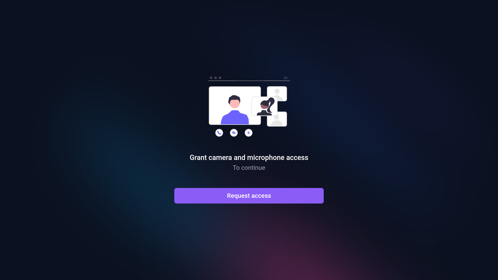

<h1 align="center">React Video Call</h1>

This application is a video-chat built using WebRTC and P2P Connections where you can call and talk to another user.

<p align="center">
  
  
  
  
</p>

<p align="center">
  
</p>

## Preview

<p align="center">
  
</p>

## Technologies

This project was developed with the following technologies:

- Server

  - [x] [Node.js](https://nodejs.org)
  - [x] [Express](https://expressjs.com)
  - [x] [Socket.io](https://socket.io)

- Web

  - [x] [ReactJS](https://reactjs.org)
  - [x] [Next.js](https://nextjs.org)
  - [x] [Tailwindcss](https://tailwindcss.com)
  - [x] [Socket.io](https://socket.io)
  - [x] [Simple Peer](https://github.com/feross/simple-peer)
  - [x] [Next PWA](https://github.com/shadowwalker/next-pwa)

## Client

Built using ReactJS, WebRTC API with simple-peer to to create P2P connections and share media stream.

## Server

Built in Node.js, using socket protocol to establishing the handshake (first contact) of user before then stablish the P2P connection.

## PWA

This application also has the PWA implementation, that is, you can install it as if it were an app.

<p align="center">
  
</p>

## Run

First clone this repository and access the folder below:

```bash
$ git clone https://github.com/Sup3r-Us3r/react-video-chat.git
$ cd react-video-chat
```

Now install all dependencies:

```bash
$ cd server
$ npm install
```

```bash
$ cd web
$ npm install
```

Start server:

```bash
$ cd server
$ npm run dev
```

Start frontend:

```bash
$ cd web
$ npm run dev
```
